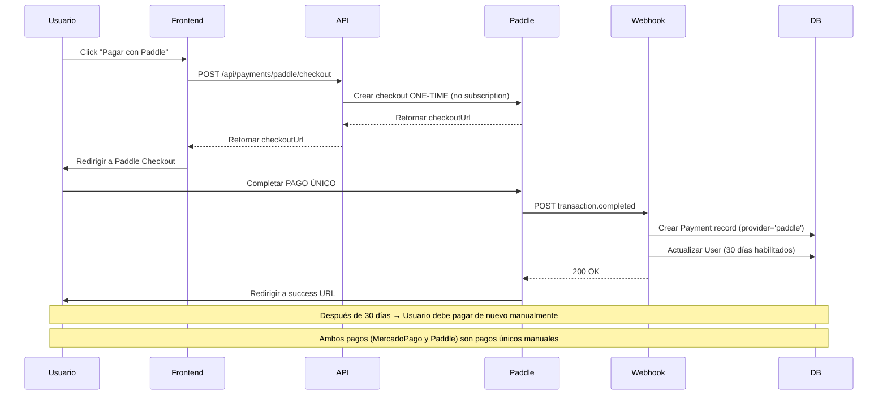

# 📝 Resumen de Integración de Paddle

## ✅ Archivos Creados/Modificados

### 1. **Dependencies** (`package.json`)
✅ Agregado `@paddle/paddle-node-sdk` v1.6.0

### 2. **Database Schema** (`prisma/schema.prisma`)
✅ Actualizado modelo `Payment` para soportar múltiples proveedores:
- Agregado campo `provider` (String): 'mercadopago' | 'paddle'
- Agregado `paddleTransactionId` (String, único)
- Agregado `paddleSubscriptionId` (String)
- Campo `mpPaymentId` ahora es nullable
- Agregados índices para optimización

### 3. **Paddle Library** (`src/lib/paddle.ts`)
✅ Librería de utilidades para Paddle:
- Inicialización del cliente Paddle
- Función `checkout.create()`: Crea sesiones de pago
- Función `verifyWebhookSignature()`: Valida webhooks
- Soporte para planes: pro, enterprise
- Soporte para billing: monthly, yearly

### 4. **Checkout Endpoint** (`src/app/api/payments/paddle/checkout/route.ts`)
✅ Endpoint para crear checkouts de Paddle:
- Ruta: `POST /api/payments/paddle/checkout`
- Autenticación requerida (verifica sesión)
- Validación de planType y billingType
- Retorna URL del checkout de Paddle

### 5. **Webhook Endpoint** (`src/app/api/payments/paddle/webhook/route.ts`)
✅ Endpoint para procesar webhooks de Paddle:
- Ruta: `POST /api/payments/paddle/webhook`
- Verificación de firma para seguridad
- Manejo de eventos: **solo transaction.completed y transaction.paid**
- ❌ NO maneja eventos de subscription (no usamos suscripciones recurrentes)
- Idempotencia: Previene procesamiento duplicado
- Transacciones atómicas con Prisma
- Actualización de días habilitados del usuario

### 6. **Migration SQL** (`prisma/migrations/.../migration.sql`)
✅ Migración de base de datos lista para ejecutar

### 7. **Documentation** (`PADDLE_SETUP.md`)
✅ Guía completa de configuración paso a paso

## 🔧 Variables de Entorno Requeridas

Agregar a tu archivo `.env.local` (y Vercel):

```bash
# PADDLE CONFIGURATION
PADDLE_ENVIRONMENT=sandbox                    # 'sandbox' o 'production'
PADDLE_API_KEY=tu_api_key_aqui
PADDLE_WEBHOOK_SECRET=tu_webhook_secret_aqui

# Price IDs (obtener desde Paddle Dashboard)
PADDLE_PRICE_PRO_MONTHLY=pri_01abc123
PADDLE_PRICE_PRO_YEARLY=pri_01abc456
PADDLE_PRICE_ENTERPRISE_MONTHLY=pri_01def789
PADDLE_PRICE_ENTERPRISE_YEARLY=pri_01ghi012
```

## 📋 Próximos Pasos (Para Ti)

### 1. **Instalar Dependencias**
```bash
pnpm install
```

### 2. **Ejecutar Migración de Base de Datos**
```bash
npx prisma migrate dev --name add_paddle_support
```

### 3. **Configurar Cuenta de Paddle**
1. Crear cuenta en https://www.paddle.com/
2. Obtener API Key del dashboard
3. Crear productos y precios
4. Configurar webhook endpoint
5. Obtener Price IDs

### 4. **Configurar Variables de Entorno**
Agregar todas las variables mencionadas arriba a:
- `.env.local` (desarrollo)
- Vercel Dashboard (producción)

### 5. **Testing**
- Usar modo sandbox primero
- Probar flujo completo de pago
- Verificar que webhooks funcionen
- Usar tarjetas de prueba de Paddle

## 🎯 Flujo de Pago con Paddle (Pago Único)



## 🔄 Comparación: MercadoPago vs Paddle

| **Característica** | MercadoPago | Paddle |
|----------------|-------------|---------|
| **Región** | Argentina principalmente | Internacional (150+ países) |
| **Moneda** | ARS | USD, EUR, GBP, etc. |
| **Impuestos** | Manual | Automático (Merchant of Record) |
| **Facturación** | Tú emites facturas | Paddle emite facturas |
| **Tipo de pago** | Pago único (manual) | Pago único (manual) |
| **Renovación** | ❌ Manual | ❌ Manual |
| **Integración** | ✅ Ya integrado | ✅ Recién integrado |
| **Webhook** | `/api/payments/mercadopago` | `/api/payments/paddle/webhook` |
| **Checkout** | `/api/payments/create-preference` | `/api/payments/paddle/checkout` |

## 🚨 Importante

### ⚠️ Aspectos Legales/Fiscales (Argentina)

Como monotributista argentino cobrando desde el exterior:

1. **Facturación**: Paddle actúa como Merchant of Record, ellos emiten las facturas a tus clientes
2. **Impuestos**: Paddle maneja automáticamente los impuestos según la región del cliente
3. **Ingresos**: Los pagos que recibas de Paddle son ingresos del exterior
4. **AFIP**: Deberás declarar estos ingresos en tu declaración jurada
5. **Monotributo**: Verifica si tus ingresos totales (Argentina + exterior) se mantienen dentro de tu categoría

**Recomendación**: Consulta con un contador especializado en comercio exterior para asegurarte de cumplir con todas las regulaciones.

## 💡 Ventajas de Paddle

✅ **Merchant of Record**: Paddle maneja toda la complejidad fiscal
✅ **Global**: Acepta pagos de 150+ países
✅ **Múltiples monedas**: USD, EUR, GBP, etc.
✅ **Facturación automática**: Paddle emite facturas a tus clientes
✅ **Impuestos incluidos**: Calcula y cobra automáticamente IVA/sales tax
✅ **Recuperación de pagos fallidos**: Paddle reintenta pagos automáticamente
✅ **Reportes**: Dashboard completo con analytics

## 🔍 Monitoreo y Debug

### Logs en Producción
Los webhooks de Paddle tienen logs detallados:
- Busca en los logs de Vercel: `WEBHOOK RECIBIDO DE PADDLE`
- Dashboard de Paddle: Developer Tools > Notifications > Event logs

### Testing de Webhooks
Paddle permite reenviar webhooks manualmente desde el dashboard para testing.

## 📞 Soporte

- **Paddle Support**: https://www.paddle.com/support
- **Documentación**: https://developer.paddle.com/
- **Status Page**: https://status.paddle.com/

---

🎉 **La integración está completa y lista para configurar!**
